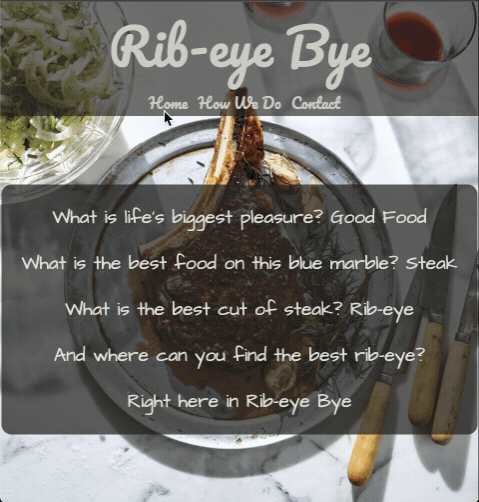

# Restaurant Page

From [the Odin Project](http://www.theodinproject.com/)'s Full-Stack JS curriculum.

The excercise focuses on using webpack to automate the process of creating, exporting, and importing modules, and manipulating DOM with javascript with only the bare minimum of HTML code needed.

[Live Demo](https://kamyar-mazloom.github.io/restaurant-page/) :point_left:

